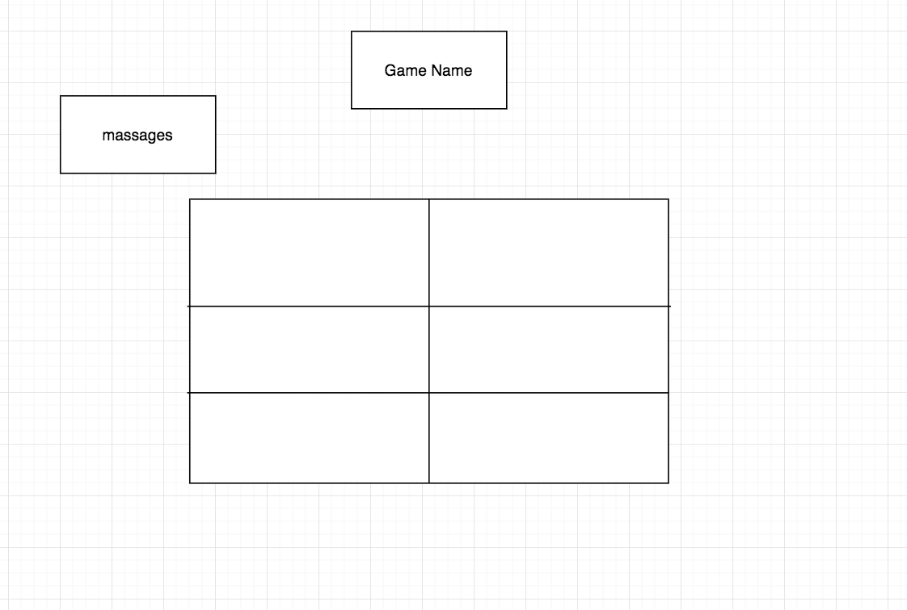

# Tic Tac Toe Game (Project 1)

## About The Project 

The project about building a tic tac toe game from scratch. the project includes separate HTML / CSS / JavaScript files.
## Wireframes

## Technologies used
-  Vanilla Javascript
- Visual Studio Code 
-  Browser Tools 
- CSS
- HTML
- Document Object Model (DOM)

## User Stories

- As a user, I should be able to start a new tic tac toe game
- As a user, I should be able to click on a square to add X first and then O, and so on
- As a user, I should be shown a message after each turn for if I win, lose, tie or who's turn it is next
- As a user, I should not be able to click the same square twice
- As a user, I should be shown a message when I win, lose or tie
- As a user, I should not be able to continue playing once I win, lose, or tie
- As a user, I should be able to play the game again without refreshing the page

## Development Process
First the program starts with HTML to put the foundation for the game. Then, CSS to draw the grid that the players work on. The program uses Vanilla Javascript and declare some functions ( winner functin to determine winner by using if statment, start the game, switch players, restart the game, and end game), also uses Dom to manipulate JS. 

 ## Winner determination
To win the game, the winner needs to align 3 X's or O's in a row, in a column, or diagonally. The program has 9 different division tags set in a grid 3x3. The program uses if statment to determine if the value of each div = X or O, and then, if 3 (X's) or 3 (O's) align in a row, in a column, or diagonally, a player wins.